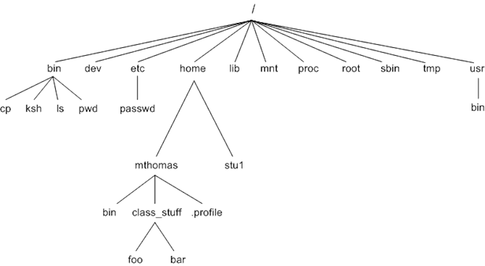

# Linux Basics

## Introduction
Linux is a kernel, not an operating system. The Linux kernel is combined with the GNU system to form a complete operating system.

## Linux File System
The Linux file system follows a hierarchical structure with the root at its highest level directory.


*Image Source: [Linux Image](https://linkedin.github.io/school-of-sre/level101/linux_basics/images/linux/commands/image17.png)*
- **bin:** The executable program of most commonly used commands resides in the bin directory.
- **dev:** This directory contains files related to devices on the system.
- **etc:** This directory contains all the system configuration files.
- **home:** This directory contains user-related files and directories.
- **lib:** This directory contains all the library files.
- **mnt:** This directory contains files related to mounted devices on the system.
- **proc:** This directory contains files related to the running processes on the system.
- **root:** This directory contains root user-related files and directories.
- **sbin:** This directory contains programs used for system administration.
- **tmp:** This directory is used to store temporary files on the system.
- **usr:** This directory is used to store application programs on the system.

## Commands for Navigating File System
- **ls:** Lists the files in the present directory.
- **pwd:** Shows the present working directory.
- **cd:** Changes the directory.

## Commands for File Manipulation
- **touch:** Used to create empty files (e.g., `touch <file_name>`).
- **mkdir:** Creates a new directory.
- **cp:** Copies files and directories from the source to the destination (e.g., `cp <source> <destination>`).
- **mv:** Moves files or directories from the source to the destination (e.g., `mv <source> <destination>`).

## Commands for File Viewing
- **cat:** Prints the content of a file on the terminal.
- **head:** Prints the first 10 lines on the screen.
- **tail:** Prints the last 10 lines on the screen.
- **more:** Displays the contents of a file or command output, one screen at a time (useful for large files).
- **less:** An improved version of `more` for both forward and backward navigation.

## Commands for Text Processing
- **grep:** Used for searching (e.g., `grep "text_for_searching" <file_name>`).
- **sed:** Used for replacing text in a file (e.g., `sed 's/<text_to_replace>/<replacement_text>/' <file_name> -i').
- **sort:** Used for sorting.

## I/O Redirection
In Linux, everything is treated as a file.
- `>`: Redirects the output of a command to a file (e.g., `ls > out.txt`).
- `|`: Used to pass the output of one command as input to another (e.g., `history | grep ssh`).

# SERVER ADMINISTRATION

Linux-based OS’s are multi-user in nature. SSH makes the life of Linux users easy by enabling multiple connections at the same time.

## SSH

### SSH Configuration Guide

1. **Locate SSH-related files**:  
   Find the SSH-related configuration files in the `/etc/ssh` directory.

2. **Disable root login**:  
   To disable root login, edit the SSH configuration file (e.g., `sshd_config`) and set the parameter `PermitRootLogin` to `no`. After making this change, restart the SSH service with the following command:
   
   ```bash
   sudo systemctl restart sshd


## USER/GROUP MANAGEMENT 

Users in Linux have a User ID (UID) attached to them. A group is a collection of users, making it easier to share permissions among a group of users. A group has a Group ID (GID).

### COMMANDS

- `id`: Lists UID and GID of the user. (0 for the root user)
- `whoami`: Prints the current user

### FILES ASSOCIATED WITH USERS/GROUPS

- `/etc/passwd`: Stores username, UID, GID, home directory. <`username:x:UID:GID:User description:/home/username:/bin/bash`>
- `/etc/shadow`: Stores the password associated with the username.
- `/etc/group`: Stores information about different groups in the system.
  Format: `groupname:x:GID:user1,user2,user3`

### COMMANDS FOR MANAGING USERS

- `useradd`: Creates a new username (`useradd <username>`).
- `passwd`: Adds or modifies the password of a user.
  After running `useradd` command, the password won't be assigned. ('sudo passwd <username>') gives a password prompt.
- `usermod`: Modifies attributes of a user like shell or home directory (`usermod <username> -s bin/sh`)
- `userdel`: Deletes a user.
- `su <username>`: Changes user from one to another.

### COMMANDS FOR MANAGING GROUPS

Similar to USER commands, but add "group" before the command (`groupadd`, `groupmod`, `groupdel`).

## FILE PERMISSIONS AND COMMANDS

Files or directories are assigned access permissions for owner, group, and other users.

- Read file: 4
- Write: 2
- Execute: 1

To be executed make sure you give read and execute permissions to a file.

### COMMANDS

- `chmod`: For changing permissions (`chmod 777 <file_name>`).
- `chown`: For changing owners of a file or directory (`chown <new_owner> <file_name>`).
- `chgrp`: For changing group ownership of files or directories (`chgrp <new_owner> <file_name>`).
- `setfacl`: This command is used to modify the access control lists (ACLs) of files or directories with respect to a user.
    - (`setfacl -m u:jim:0`) - This command removes all permissions (read, write, and execute) for the user jim


## PROCESS MANAGEMENT

- `ps`: Gives a list of processes.
- `ps aux`: Displays information about all processes along with users running them.
- `grep` in combination with `ps` command to list only specific processes. (e.g., `ps | grep -i 'java'`)
  - `-i` for making search case insensitive.
- `top`: Displays real-time information about Linux processes, including process ID, owner, priority, state, CPU utilization, memory utilization, system uptime, and CPU load average.
- `htop`: Interactive version of `top`.
- `lsof`: Lists open files and associated processes.

## MEMORY MANAGEMENT

- `free`: Displays memory usage of the system (`free -h` to display in GB).
- `vmstat`: Displays memory usage, I/O, and CPU statistics.
- `df`: Displays free and available space for each mounted file system (`df -h` to display in GB).
- `du`: Displays disk usage of files and directories on the system.
- **Swap space:** Reserved area on a storage device used as an extension of physical RAM when memory is fully utilized.
- **Daemons:** Processes that run in the background without user interaction.
- `systemd`: Linux system and service manager, utilizing unit configuration files (ending with `.service`) in `/usr/lib/systemd/system` to manage services.
  - `systemctl` is used to start, stop, and restart these services.  (systemctl start name.service - Starts a service)

## LOGS

- `/var/log`: Stores logs related to daemon processes along with system logs.
- `dmesg`: Shows kernel logs.

## Ctrl+C VS Ctrl+Z

- 'Ctrl+C' - Sends SIGINT signal to the process for termination.
- 'Ctrl+V' - Sends SIGTSTP signal that suspends the process and puts in background. It can be resumed using 'fg' or to get it working in foreground  or use 'bg' to keep it running in background.

## Network Commands 


## DNS (Domain Name System):

### nslookup:
- This command is used to query DNS servers to obtain domain name or IP address mapping, or other DNS records.
- Example: nslookup example.com

## Using Hostname Aliases Instead of IP Addresses

Instead of directly pinging an IP address, you can set up hostname aliases in your `/etc/hosts` file. This allows you to associate a recognizable hostname with an IP address locally, making it easier to manage and reference frequently accessed hosts.

### Example:

Suppose you want to ping the Google DNS server `8.8.8.8`. Instead of typing `ping 8.8.8.8` every time, you can set up an alias in your `/etc/hosts` file like this:

```
8.8.8.8 google
```

Now, you can simply use the hostname `google` instead of the IP address when pinging:

```bash
ping google
```

## UDP (User Datagram Protocol):

### netcat or nc:
- Netcat can be used to create UDP connections and send data over UDP.
- Example: echo "Hello, UDP Server!" | nc -u server_ip port

  
### udpdump:
- This command is used to capture and analyze UDP packets on a network interface.
- Example: sudo udpdump -i eth0 udp port 53


## HTTP (Hypertext Transfer Protocol):

### curl:
- A command-line tool for transferring data using various protocols, including HTTP.
- Example: curl https://api.example.com/data


### wget:
- Another command-line tool for downloading files from the web, which supports HTTP.
- Example: wget https://example.com/file.txt


### telnet:
- While not exclusive to HTTP, it can be used to interact with HTTP servers directly by sending raw HTTP requests.
- Example: example.com 80


## TCP (Transmission Control Protocol):

### netstat:
- This command displays TCP connections and listening ports.
- Example: netstat -a


### telnet:
- Similar to its use with HTTP, telnet can be used to establish TCP connections to specific ports on remote servers for testing purposes.
- Example:  telnet example.com 443


## Routing:

### route
- This command display and manipulate the IP routing table.
- Example:  route -n


### traceroute or tracert:
- These commands are used to trace the route packets take from one networked device to another.
- Example: traceroute example.com

## Tar

### 1. `tar` Command Overview
- The `tar` command is used to create, extract, and manage archive files in Unix-like systems. It stands for **t**ape **ar**chive
  and it can bundle multiple files and directories into a single file

- **`tar -cvf`**: Creates an uncompressed `.tar` archive file.
- **`tar -czvf`**: Creates a compressed `.tar.gz` archive using gzip.

## Cron

- Cron is a time based scheduler allowing users to automate repetitive tasks by scheduling commands or scripts to run at  intervals.

#### Example Cron Syntax

crontab -e 

```bash
* * * * * command/to/run
| | | | |
| | | | ----- Day of the week (0 - 7) (Sunday=0 or 7)
| | | ------- Month (1 - 12)
| | --------- Day of the month (1 - 31)
| ----------- Hour (0 - 23)
------------- Minute (0 - 59)

- For a particular user to allow to set a cron job. Create a file /etc/cron.allow and enter user name.
- To deny, Create a file /etc/cron.deny and enter user name.

## Shutdown from CLI

```bash
/sbin/shutdown now
```